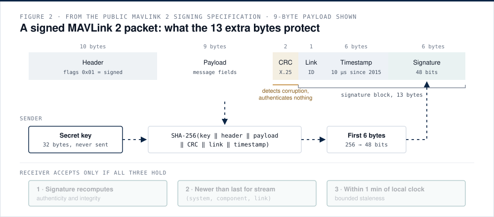

<p align="center"></p>

[](https://github.com/darkanalytica1/uas-cyber-threat-model/actions/workflows/tests.yml)


## What this is

A defensive, educational threat model for small unmanned aircraft systems, written as data and backed by small, tested Python tools. STRIDE is applied to six trust boundaries (air vehicle, companion computer, datalink, ground control station, cloud and fleet API, supply chain); every one of the 36 cells is filled, and each threat is paired with the controls that counter it and the residual risk that remains. Alongside the matrix are working, tested illustrations of the controls that carry most weight: MAVLink 2 message signing with its freshness rules and forgery arithmetic, a secure update chain with anti-rollback, and a tamper-evident hash-chained log.

## Why it matters

An unmanned aircraft is a distributed system whose moving node is the hardest to defend, and whose softest target is usually the laptop on the ground. "The link is encrypted" answers one cell of a 36-cell matrix. A threat model that names every cell turns a vague question ("is it secure?") into specific, testable ones: is message authentication enforced and how are keys provisioned, where is the root of trust and who holds the signing keys, what does the flight controller accept from the payload computer, what happens when navigation sources disagree, and can the logs be trusted after an incident. Those are the questions design reviews, supplier evaluations and accreditation authorities need answered.

<p align="center"></p>

*Figure 1. Six surfaces and their trust boundaries. The ground control station and the datalink (red outlines) are the most frequently attacked. A signed, fresh command passes the radio boundary; a frame without a valid tag is rejected there.*

## Quick start

```bash
git clone https://github.com/darkanalytica1/uas-cyber-threat-model
cd uas-cyber-threat-model
pip install -r requirements.txt
python -m uasthreat validate        # all 36 STRIDE cells covered, references consistent
python -m uasthreat render          # regenerate docs/MATRIX.md and docs/matrix.html from the YAML
python -m uasthreat signing-demo    # genuine accepted; replay, bit flip, wrong key, stale rejected
python -m uasthreat forgery         # 2^-48 per guess, about 890 years at 10,000 guesses/s
python -m uasthreat update-demo     # altered image, rollback, wrong component, unknown signer rejected
python -m uasthreat log-demo        # edits and deletions detected; truncation and rewrite need the anchor
pip install -r requirements-dev.txt && python -m pytest
```

## The matrix

The source of truth is [`data/threat-model.yaml`](data/threat-model.yaml). The rendered matrix, with every threat, control and residual risk, is in [docs/MATRIX.md](docs/MATRIX.md) (and as a standalone page in `docs/matrix.html`). A test fails if the committed renders drift from the data.

| Surface | S · Spoofing | T · Tampering | R · Repudiation | I · Disclosure | D · Denial | E · Elevation |
|---|---|---|---|---|---|---|
| **AV** Air vehicle | counterfeit GNSS position | port access to parameters, firmware | unattributed mode change | captured airframe exposes keys | GNSS jamming | unsigned image, open debug port |
| **CC** Companion computer | impersonated onboard service | modified autonomy or models | untraceable decision | payload data leak | resource exhaustion | unrestricted bus to flight control |
| **DL** Datalink | unauthenticated commands; replay | altered telemetry | fleet-wide shared key | passive listening | jamming, flooding | privileged commands from any sender |
| **GCS** Ground station | stolen operator credentials | altered mission file | shared accounts | lost laptop | malware during mission | local privilege escalation |
| **API** Cloud and fleet | leaked bearer token | altered logs or config | no audit trail | object-level authorisation flaw | outage, abuse | function-level authorisation flaw |
| **SC** Supply chain | counterfeit part, impostor server | malicious component | unknown shipped config | signing key leak | faulty update | compromised build signs code |

<p align="center"></p>

*Figure 2. The 13-byte MAVLink 2 signature block. The tag is the first 48 bits of SHA-256 over the secret key, header, payload, CRC, link ID and timestamp; the receiver also enforces a strictly increasing timestamp per stream and a one-minute staleness bound.*

## Method

| Module | Contents |
|---|---|
| `uasthreat.model` | loads the YAML; `validate()` enforces full STRIDE coverage per surface, known controls and boundaries |
| `uasthreat.render` | deterministic Markdown and HTML matrix, per-surface detail tables, control catalogue with back-references |
| `uasthreat.signing` | MAVLink 2 framing and CRC, `signature48` per the specification, `SigningVerifier` acceptance rules, forgery probability calculator |
| `uasthreat.update_chain` | manifest verification, digest, component binding, anti-rollback floor, boot chain that stops at first failure |
| `uasthreat.hashlog` | hash-chained log, verification, HMAC anchor, JSONL persistence |

Documentation:

1. [STRIDE applied to an unmanned aircraft system](docs/01-stride-for-uas.md)
2. [The attack surface, component by component](docs/02-attack-surface.md)
3. [MAVLink 2 message signing](docs/03-mavlink-signing.md): tag structure, 48-bit truncation, keyed-prefix hash versus HMAC, brute-force arithmetic
4. [Replay and freshness](docs/04-replay-and-freshness.md)
5. [Secure boot and the update chain of trust](docs/05-secure-update-chain.md)
6. [Tamper-evident, hash-chained logging](docs/06-tamper-evident-logging.md)
7. [Defensive checklists](docs/CHECKLISTS.md): hardening, key management, supplier questions, pre-flight, incident

## Limitations and assumptions

- **Strictly defensive.** Threats are described at design-review depth, as classes and the conditions that enable them. There is no exploit code and no step-by-step attack guidance. The signing code signs and verifies; it offers nothing to anyone without the key.
- **A generic reference architecture.** Real systems add surfaces (mobile apps, payload links, remote identification, maintenance tooling) and remove others. Residual risks are generic judgement and must be reassessed per system and mission.
- **STRIDE enumerates; it does not score.** Likelihood and impact need a separate, mission-specific assessment.
- **Illustrations, not libraries.** The MAVLink code follows the public signing specification to test its rules; it is not an interoperability-tested protocol implementation. The update chain uses an HMAC stand-in because the standard library has no public-key signatures; real devices verify asymmetric signatures and hold no signing secret.
- **Tamper evidence is not truth.** A hash chain proves a log was not altered afterwards, not that a compromised node recorded events honestly.

## Sources

MAVLink message signing and serialization specifications; RFC 2104; FIPS 180-4; NIST SP 800-57, 800-92, 800-193, 800-207; IEC 62443; OWASP API Security Top 10; RFC 9700; NTIA SBOM minimum elements; SLSA; Shostack (2014); Crosby and Wallach (2009); Psiaki and Humphreys (2016). Full references and confidence notes: [docs/SOURCES.md](docs/SOURCES.md).

## License

MIT. See [LICENSE](LICENSE).

<sub>DarkAnalytica · public sources and original synthesis · defensive, educational use</sub>
