# 02 · The attack surface, component by component

The full matrix, with every threat and control, is in [MATRIX.md](MATRIX.md). This page explains the reasoning behind the most important rows.

## 2.1 Ground control station: usually the softest target

The GCS is a general-purpose laptop or tablet: an operating system, a browser, a mission planning application, USB ports and a network stack. It concentrates credentials, link keys, mission plans and the live picture. Compromise it and the adversary operates the mission with the legitimate controller's authority, without touching the radio.

Controls that work are unglamorous: a dedicated, hardened device; patching by version; application allow-listing; no general browsing or email; individual accounts with phishing-resistant multi-factor authentication; full-disk encryption; a tested spare.

## 2.2 Datalink: authentication before encryption

A protocol without message authentication accepts any well-formed frame. A checksum does not change this, because anyone can recompute it. The link needs a keyed construction and a freshness rule: see [03](03-mavlink-signing.md) and [04](04-replay-and-freshness.md). Encryption adds confidentiality, which matters for video and position, but it does not replace authentication and it does not hide the emission from direction finding.

## 2.3 Navigation: a cyber-physical integrity problem

Civil GNSS signals are not authenticated, so a receiver cannot cryptographically tell a real signal from a counterfeit. The vulnerability is architectural: a flight controller that accepts one unauthenticated position source as truth. The control is also architectural: independent navigation sources and an estimator that rejects physically inconsistent input. The companion repository [gnss-denied-navigation-primer](https://github.com/darkanalytica1/gnss-denied-navigation-primer) simulates this.

## 2.4 Companion computer: segmentation is the control

The companion computer runs the richest and most frequently updated software on the aircraft. If it shares an unrestricted bus with the flight controller, its compromise becomes flight-control compromise. Segmentation applies the IEC 62443 idea of zones and conduits: the flight controller accepts only an allow-listed, validated command set from the payload zone, so a fully compromised payload cannot command arbitrary behaviour.

## 2.5 Firmware and update path: where persistence happens

Without secure boot, modified firmware loaded over USB, SD card or over the air survives reboots and resets. With a verified chain anchored in a hardware root of trust, the same attempt fails at the signature check, and the three update routes collapse into one enforced gate. See [05](05-secure-update-chain.md).

## 2.6 Cloud and fleet API: ordinary web risks, physical consequences

The leading API risks apply unchanged: broken object-level authorisation (changing an identifier returns another tenant's data) and broken authentication (a stolen bearer token works for its whole lifetime). For a fleet, the exposed object can be live aircraft position, historical flight paths that reveal patterns, or tasking. Controls: server-side authorisation of every object and function from the caller's identity, short-lived and narrowly scoped tokens, rate limiting, and aircraft that keep working when the cloud does not.

## 2.7 Supply chain: evidence, not a single control

No organisation controls its whole supply chain, so it is managed with artefacts: a software bill of materials to answer "are we affected?" in minutes, build provenance and reproducible builds so a binary can be tied to its source, configuration management so you know what is on each unit, and staged rollouts so one bad update does not ground a fleet.

## 2.8 Tamper-evident logging: where repudiation is defeated

Repudiation is answered by logs whose alteration is detectable and whose timestamps can be trusted across aircraft, ground station and backend. See [06](06-tamper-evident-logging.md).

## Limitations

This is a defensive reference at design-review depth. It deliberately describes threat classes and the mechanisms that make them possible in general terms, and does not describe how to exploit any system.
